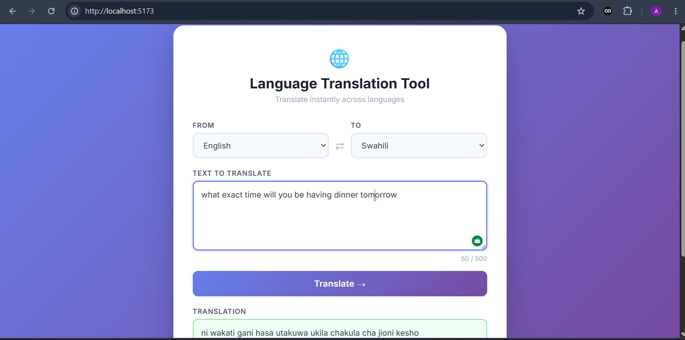

# Language Translation Tool

A language translation web app built with React and TypeScript.



## Live Demo

🔗 [View Live App](https://codealpha-translationtool.vercel.app)

## Features

- Translate text across 10 languages
- Real-time character counter
- Copy translated text to clipboard
- Clean, responsive UI
- Error and loading state handling

## Tech Stack

- React + TypeScript
- Vite
- MyMemory Translation API

## How to Run

```bash
npm install
npm run dev
```
